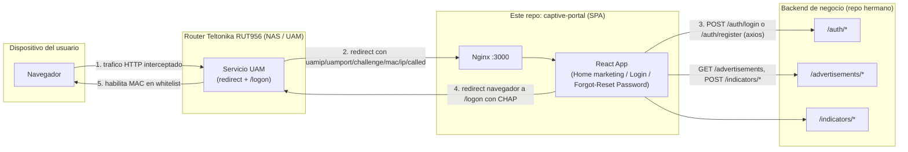
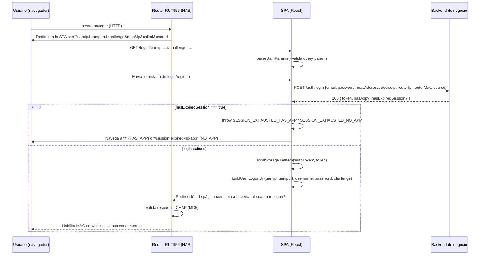

# Arquitectura

## Visión general

`mindfactory-busdigital-captive-portal` es una **SPA (Single Page Application)** construida con **React 18 + TypeScript + Vite**, cuyo propósito es autenticar usuarios de una red WiFi de flota de buses e integrarse con el protocolo **UAM** (Universal Access Method) de un router **Teltonika RUT956** actuando como NAS (Network Access Server). No implementa un servidor RADIUS ni firewall propio: delega esas funciones al router y a un backend de negocio externo.

## Componentes del sistema (más allá de este repo)



## Flujo de autenticación (detallado)



Puntos clave de este flujo:

- Hay **dos autenticaciones distintas y desacopladas**: (a) autenticación de negocio contra el backend propio (email/password → JWT), y (b) autorización de red contra el NAS (CHAP → whitelist de MAC). El login de negocio ocurre primero; solo si es exitoso (y sin sesión agotada) se dispara la redirección UAM.
- La redirección al NAS es una **navegación de página completa** (`globalThis.location.href = loginUrl`), no una llamada AJAX.
- **Sesión agotada (`hasExpiredSession`)**: si el backend indica que el usuario agotó su tiempo de conexión gratuito, el login lanza `SESSION_EXHAUSTED_HAS_APP` (si `hasApp: true`, navega a `/`) o `SESSION_EXHAUSTED_NO_APP` (si `hasApp: false`, navega a `/session-expired-no-app`), ambos manejados en [`LoginTab.tsx`](../../src/components/LoginTab.tsx).

## Rutas (`src/routes/RouterApp.tsx`)

El router es plano y público — cualquier ruta es accesible sin sesión, sin guards de autenticación basados en `localStorage.authToken`:

```txt
/                       → Home (landing de marketing, pública, no requiere login)
/login                  → Login (tabs Iniciar sesión / Registrarse)
/forgot-password        → ForgotPassword
/reset-password         → ResetPassword (lee ?token= de query string)
/session-expired-no-app → SessionExpiredNoApp
/session-expired-has-app→ SessionExpiredHasApp
/open-app               → SessionExpiredHasApp (mismo componente)
```

[`Layout.tsx`](../../src/components/layout/Layout.tsx) decide si mostrar `Header`/`Footer`/`StickyDock` en base a una lista de "páginas de auth" (`isAuthPage`): `/login`, `/forgot-password`, `/reset-password`, `/session-expired-no-app`, `/session-expired-has-app`, `/open-app`. En esas rutas no se renderiza el chrome de marketing (cada página trae su propio logo). En `/` sí se renderiza el chrome completo (Header con selector de tema + anuncios, StickyDock de descarga, Footer).

## Estructura de directorios (`src/`)

```txt
src/
  main.tsx              # entry point, importa @fontsource/plus-jakarta-sans + index.css
  App.tsx                # ThemeManager + RouterApp
  routes/RouterApp.tsx  # rutas planas, sin guards (ver arriba)
  pages/
    Home.tsx             # orquestador: Hero + HowItWorks + UrgencyTimer + FinalCTA
    Login.tsx            # tabs Login/Register + FooterAdvertisement
    ForgotPassword.tsx   # solicitud de recupero de contraseña
    ResetPassword.tsx    # formulario de nueva contraseña (?token=)
    SessionExpiredNoApp.tsx  # "tiempo gratuito agotado", guía de instalación de la app
    SessionExpiredHasApp.tsx # "abriendo la app...", redirect automático a /open-app
  components/
    LoginTab.tsx, RegisterTab.tsx      # formularios (Formik + Yup)
    FooterAdvertisement.tsx            # anuncios rotativos en pie de páginas de auth
    home/
      HeroSection.tsx      # hero hardcodeado + mockup de app + CTA #hero-cta
      HowItWorks.tsx       # 4 pasos hardcodeados
      UrgencyTimer.tsx     # countdown decorativo de 9 min (marketing, no refleja sesión real)
      FinalCTA.tsx         # sección final de conversión
    layout/
      Header.tsx     # AppBar + toggle de tema + botón descargar + <HeaderAds/>
      HeaderAds.tsx   # anuncios geolocalizados/por horario
      Footer.tsx
      StickyDock.tsx  # barra inferior sticky de descarga, aparece al hacer scroll pasado el hero
      Layout.tsx      # decide mostrar/ocultar chrome según isAuthPage
    common/
      AdvertisementDialog.tsx, BoxCards.tsx, ConnectingSpinner.tsx, CustomButton.tsx
  interfaces/
    advertisingIntefaces.ts  # Advertisement, FilteredAdvertisement
    userInterface.ts
  services/
    axiosInstance.ts       # cliente axios (baseURL VITE_BASE_URL, interceptor Bearer token)
    authService.ts         # login/register/forgot-reset password
    advertisementTracking.ts  # eventos view/click/view-more/retención
  utils/
    parseUamParams.ts   # uamip/uamport/challenge/mac/userurl/redirurl/ssl/ip/called
    uamChap.ts           # chapResponse() (MD5) + buildUamLogonUrl()
    handleError.ts       # handleError() + translateErrorMessage() (mensajes de error → español)
  themes/ThemeManager.tsx  # Context + ThemeProvider MUI, dark/light mode persistido en localStorage
```

## Decisiones de arquitectura notables

- **Sin estado global de negocio** (no Redux/Zustand): el único estado "global" es el **tema visual** (`ThemeContext` en `ThemeManager.tsx`, con `useThemeMode()`), y la sesión sigue viviendo en `localStorage` (`authToken`). El resto es estado local de componente.
- **Sin guards de ruta**: el Home no es una pantalla "post-login" sino una landing pública de marketing/descarga de la app, coherente con el pivot del producto hacia empujar la instalación de la app nativa en vez de depender solo del portal web.
- **`UrgencyTimer` es marketing, no session-real**: el countdown de 9 minutos en el Home es un valor hardcodeado en el cliente para presión de conversión — no está sincronizado con el timeout real de sesión configurado en el router/backend. No usarlo como fuente de verdad para soporte a usuarios.
- **Deep-linking a la app nativa**: `public/.well-known/assetlinks.json` habilita Android App Links hacia `com.busdigital.app`, usado por el flujo de `/open-app` (`SessionExpiredHasApp.tsx`).
- **Sin base de datos ni persistencia propia**: toda persistencia de usuarios, sesiones y publicidades es responsabilidad del backend de negocio. Ver [03-base-datos.md](03-base-datos.md).

## Referencias cruzadas

- API consumida: [02-api.md](02-api.md)
- Modelo de datos (fuera de este repo): [03-base-datos.md](03-base-datos.md)
- Consideraciones de seguridad del protocolo CHAP y manejo de tokens: [04-seguridad.md](04-seguridad.md)
- Tema visual y assets de marca: [../03-customization/01-temas.md](../03-customization/01-temas.md)
